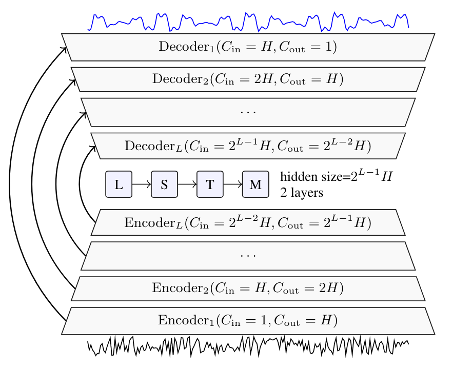
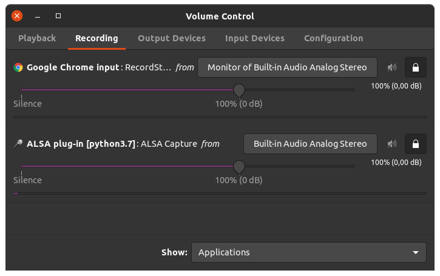

# Real Time Speech Enhancement in the Waveform Domain (Interspeech 2020)


We provide a [PyTorch][pytorch] implementation of the paper: [Real Time Speech Enhancement in the Waveform Domain][arxiv].
In which, we present a causal speech enhancement model working on the raw waveform that runs in real-time on a laptop CPU.
The proposed model is based on an encoder-decoder architecture with skip-connections. It is optimized on both time and frequency domains, using multiple loss functions.
Empirical evidence shows that it is capable of removing various kinds of background noise including stationary and non-stationary noises, as well as room reverb.
Additionally, we suggest a set of data augmentation techniques applied directly on the raw waveform which further improve model performance and its generalization abilities.

Audio samples can be found here: [Samples][web]

<p align="center">
</p>


The proposed model is based on the Demucs architecture, originally proposed for music source-separation: ([Paper][demucs-ppr], [Code][demucs-code]).

## Installation

First, install Python 3.7 (recommended with Anaconda).

#### Through pip (you just want to use pre-trained model out of the box)

Just run
```bash
pip install denoiser
```

#### Development (if you want to train or hack around)

Clone this repository and install the dependencies. We recommend using
a fresh virtualenv or Conda environment.

```bash
git clone https://github.com/facebookresearch/denoiser
cd denoiser
pip install -r requirements.txt  # If you don't have cuda
pip install -r requirements_cuda.txt  # If you have cuda
```

## Live Speech Enhancement

If you want to use `denoiser` live (for a Skype call for instance), you will
need a specific loopback audio interface.

### Mac OS X

On Mac OS X, this is provided by [Soundflower][soundflower].
First install Soundflower, and then you can just run

```bash
python -m denoiser.live
```

In your favorite video conference call application, just select "Soundflower (2ch)"
as input to enjoy your denoised speech.

Watch our live demo presentation in the following link: [Demo][demo].

### Linux (tested on Ubuntu 20.04)

You can use the `pacmd` command and the `pavucontrol` tool:
- run the following commands:
```bash
pacmd load-module module-null-sink sink_name=denoiser
pacmd update-sink-proplist denoiser device.description=denoiser
```
This will add a `Monitor of Null Output` to the list of microphones to use. Select it as input in your software. 
- Launch the `pavucontrol` tool. In the _Playback_ tab, after launching 
`python -m denoiser.live --out INDEX_OR_NAME_OF_LOOPBACK_IFACE` and the software you want to denoise for (here an in-browser call), you should see both applications. For *denoiser* interface as Playback destination which will output the processed audio stream on the sink we previously created.
<p align="center">
</p>


### Other platforms

At the moment, we do not provide official support for other OSes. However, if you
have a a soundcard that supports loopback (for instance Steinberg products), you can try
to make it work. You can list the available audio interfaces with `python -m sounddevice`.
Then once you have spotted your loopback interface, just run
```bash
python -m denoiser.live --out INDEX_OR_NAME_OF_LOOPBACK_IFACE
```
By default, `denoiser` will use the default audio input. You can change that with the `--in` flag.

Note that on Windows you will need to replace `python` by `python.exe`.


### Troubleshooting bad quality in separation

`denoiser` can introduce distortions for very high level of noises.
Audio can become crunchy if your computer is not fast enough to process audio in real time.
In that case, you will see an error message in your terminal warning you that `denoiser`
is not processing audio fast enough. You can try exiting all non required applications.

`denoiser` was tested on a Mac Book Pro with an 2GHz quadcore Intel i5 with DDR4 memory.
You might experience issues with DDR3 memory. In that case you can trade overall latency for speed by processing multiple frames at once. To do so, run
```
python -m denoiser.live -f 2
```
You can increase to `-f 3` or more if needed, but each increase will add 16ms of extra latency.


### Denoising received speech

You can also denoise received speech, but you won't be able to both denoise your own speech
and the received speech (unless you have a really beefy computer and enough loopback
audio interfaces). This can be achieved by selecting the loopback interface as
the audio output of your VC software and then running
```bash
python -m denoiser.live --in "Soundflower (2ch)" --out "NAME OF OUT IFACE"
```

## Training and evaluation

### Quick Start with Toy Example

1. Run `sh make_debug.sh` to generate json files for the toy dataset.
2. Run `python train.py`

### Configuration

We use [Hydra][hydra] to control all the training configurations. If you are not familiar with Hydra
we recommend visiting the Hydra [website][hydra-web].
Generally, Hydra is an open-source framework that simplifies the development of research applications
by providing the ability to create a hierarchical configuration dynamically.

The config file with all relevant arguments for training our model can be found under the `conf` folder.
Notice, under the `conf` folder, the `dset` folder contains the configuration files for
the different datasets. You should see a file named `debug.yaml` with the relevant configuration for the debug sample set.

You can pass options through the
command line, for instance `./train.py demucs.hidden=32`.
Please refer to [conf/config.yaml](conf/config.yaml) for a reference of the possible options.
You can also directly edit the `config.yaml` file, although this is not recommended
due to the way experiments are automatically named, as explained hereafter.

### Checkpointing

Each experiment will get a unique name based on the command line options you passed.
Restarting the same command will reuse the existing folder and automatically
start from a previous checkpoint if possible. In order to ignore previous checkpoints,
you must pass the `restart=1` option.
Note that options like `device`, `num_workers`, etc. have no influence on the experiment name.


### Setting up a new dataset

If you want to train using a new dataset, you can:
1. Create a separate config file for it.
2. Place the new config files under the `dset` folder. Check [conf/dset/debug.yaml](conf/dset/debug.yaml)
for more details on configuring your dataset.
3. Point to it either in the general config file or via the command line, e.g. `./train.py dset=name_of_dset`.

You also need to generate the relevant `.json`files in the `egs/`folder.
For that purpose you can use the `python -m denoiser.audio` command that will
scan the given folders and output the required metadata as json.
For instance, if your noisy files are located in `$noisy` and the clean files in `$clean`, you can do

```bash
out=egs/mydataset/tr
mkdir -p $out
python -m denoiser.audio $noisy > $out/noisy.json
python -m denoiser.audio $clean > $out/clean.json
```

## Usage

### 1. Data Structure
The data loader reads both clean and noisy json files named: `clean.json` and `noisy.json`. These files should contain all the paths to the wav files to be used to optimize and test the model along with their size (in frames).
You can use `python -m denoiser.audio FOLDER_WITH_WAV1 [FOLDER_WITH_WAV2 ...] > OUTPUT.json` to generate those files.
You should generate the above files for both training and test sets (and validation set if provided). Once this is done, you should create a yaml (similarly to `conf/dset/debug.yaml`) with the dataset folders' updated paths.
Please check [conf/dset/debug.yaml](conf/dset/debug.yaml) for more details.


### 2. Training
Training is simply done by launching the `train.py` script:

```
./train.py
```

This scripts read all the configurations from the `conf/config.yaml` file.

#### Distributed Training

To launch distributed training you should turn on the distributed training flag. This can be done as follows:

```
./train.py ddp=1
```

#### Logs

Logs are stored by default in the `outputs` folder. Look for the matching experiment name.
In the experiment folder you will find the `best.th` serialized model, the training checkpoint `checkpoint.th`,
and well as the log with the metrics `trainer.log`. All metrics are also extracted to the `history.json`
file for easier parsing. Enhancements samples are stored in the `samples` folder (if `noisy_dir` or `noisy_json`
is set in the dataset).

#### Fine tuning

You can fine-tune one of the 3 pre-trained models `dns48`, `dns64` and `master64`. To do so:
```
./train.py continue_pretrained=dns48
./train.py continue_pretrained=dns64 demucs.hidden=64
./train.py continue_pretrained=master64 demucs.hidden=64
```

### 3. Evaluating

Evaluating the models can be done by:

```
python -m denoiser.evaluate --model_path=<path to the model> --data_dir=<path to folder containing noisy.json and clean.json>
```
Note that the path given to `--model_path` should be obtained from one of the `best.th` file, not `checkpoint.th`.
It is also possible to use pre-trained model, using either `--dns48`, `--dns64`or `--master64`.
For more details regarding possible arguments, please see:

```
usage: denoiser.evaluate [-h] [-m MODEL_PATH | --dns48 | --dns64 | --master64]
                         [--device DEVICE] [--dry DRY]
                         [--num_workers NUM_WORKERS] [--streaming]
                         [--data_dir DATA_DIR] [--matching MATCHING]
                         [--no_pesq] [-v]

Speech enhancement using Demucs - Evaluate model performance

optional arguments:
  -h, --help            show this help message and exit
  -m MODEL_PATH, --model_path MODEL_PATH
                        Path to local trained model.
  --dns48               Use pre-trained real time H=48 model trained on DNS.
  --dns64               Use pre-trained real time H=64 model trained on DNS.
  --master64            Use pre-trained real time H=64 model trained on DNS
                        and Valentini.
  --device DEVICE
  --dry DRY             dry/wet knob coefficient. 0 is only input signal, 1
                        only denoised.
  --num_workers NUM_WORKERS
  --streaming           true streaming evaluation for Demucs
  --data_dir DATA_DIR   directory including noisy.json and clean.json files
  --matching MATCHING   set this to dns for the dns dataset.
  --no_pesq             Don't compute PESQ.
  -v, --verbose         More loggging
```

### 4. Denoising

Generating the enhanced files can be done by:

```
python -m denoiser.enhance --model_path=<path to the model> --noisy_dir=<path to the dir with the noisy files> --out_dir=<path to store enhanced files>
```
Notice, you can either provide `noisy_dir` or `noisy_json` for the test data.
Note that the path given to `--model_path` should be obtained from one of the `best.th` file, not `checkpoint.th`.
It is also possible to use pre-trained model, using either `--dns48`, `--dns64`or `--master64`.
 For more details regarding possible arguments, please see:
```
usage: denoiser.enhance [-h] [-m MODEL_PATH | --dns48 | --dns64 | --master64]
                        [--device DEVICE] [--dry DRY]
                        [--num_workers NUM_WORKERS] [--streaming]
                        [--out_dir OUT_DIR] [--batch_size BATCH_SIZE] [-v]
                        [--noisy_dir NOISY_DIR | --noisy_json NOISY_JSON]

Speech enhancement using Demucs - Generate enhanced files

optional arguments:
  -h, --help            show this help message and exit
  -m MODEL_PATH, --model_path MODEL_PATH
                        Path to local trained model.
  --dns48               Use pre-trained real time H=48 model trained on DNS.
  --dns64               Use pre-trained real time H=64 model trained on DNS.
  --master64            Use pre-trained real time H=64 model trained on DNS
                        and Valentini.
  --device DEVICE
  --dry DRY             dry/wet knob coefficient. 0 is only input signal, 1
                        only denoised.
  --num_workers NUM_WORKERS
  --streaming           true streaming evaluation for Demucs
  --out_dir OUT_DIR     directory putting enhanced wav files
  --batch_size BATCH_SIZE
                        batch size
  -v, --verbose         more loggging
  --noisy_dir NOISY_DIR
                        directory including noisy wav files
  --noisy_json NOISY_JSON
                        json file including noisy wav files
```

### 5. Reproduce Results

Here we provide a detailed description of how to reproduce the results from the paper:
#### Valentini dataset
1. Download [Valentini dataset][valentini].
2. Adapt the Valentini config file and run the processing script.
3. Generate the egs/ files as explained here after.
4. Launch the training using the `launch_valentini.sh` (or `launch_valentini_nc.sh` for non causal) script.


**Important:** unlike what we stated in the paper, the causal models were trained with a weight of 0.1
for the STFT loss, not 0.5.

To create the egs/ file, adapt and run the following code
```bash
noisy_train=path to valentini
clean_train=path to valentini
noisy_test=path to valentini
clean_test=path to valentini
noisy_dev=path to valentini
clean_dev=path to valentini

mkdir -p egs/val/tr
mkdir -p egs/val/cv
mkdir -p egs/val/tt

python -m denoiser.audio $noisy_train > egs/val/tr/noisy.json
python -m denoiser.audio $clean_train > egs/val/tr/clean.json

python -m denoiser.audio $noisy_test > egs/val/tt/noisy.json
python -m denoiser.audio $clean_test > egs/val/tt/clean.json

python -m denoiser.audio $noisy_dev > egs/val/cv/noisy.json
python -m denoiser.audio $clean_dev > egs/val/cv/clean.json
```

#### DNS dataset
1. Download both [DNS dataset][dns], be sure to use the interspeech2020 branch.
2. Setup the paths in the DNS config file to suit your setup and run the processing script.
3. Generate the egs/ files as explained here after.
4. Launch the training using the `launch_dns.sh` script.

To create the egs/ file, adapt and run the following code
```bash
dns=path to dns
noisy=path to processed noisy
clean=path to processed clean
testset=$dns/datasets/test_set
mkdir -p egs/dns/tr
python -m denoiser.audio $noisy > egs/dns/tr/noisy.json
python -m denoiser.audio $clean > egs/dns/tr/clean.json

mkdir -p egs/dns/tt
python -m denoiser.audio $testset/synthetic/no_reverb/noisy $testset/synthetic/with_reverb/noisy > egs/dns/tt/noisy.json
python -m denoiser.audio $testset/synthetic/no_reverb/clean $testset/synthetic/with_reverb/clean > egs/dns/tt/clean.json
```

## Online Evaluation
Our online implementation is based on pure python code with some optimization of the streaming convolutions and transposed convolutions.
We benchmark this implementation on a quad-core Intel i5 CPU at 2 GHz.
The Real-Time Factor (RTF) of the proposed models are:

| Model | Threads | RTF  |
|-------|---------|------|
| H=48  | 1       | 0.8  |
| H=64  | 1       | 1.2  |
| H=48  | 4       | 0.6  |
| H=64  | 4       | 1.0  |


In order to compute the RTF on your own CPU launch the following command:
```
python -m denoiser.demucs --hidden=48 --num_threads=1
```
The output should be something like this:
```
total lag: 41.3ms, stride: 16.0ms, time per frame: 12.2ms, delta: 0.21%, RTF: 0.8
```
Feel free to explore different settings, i.e. bigger models and more CPU-cores.


## Citation
If you use the code in your paper, then please cite it as:
```
@inproceedings{defossez2020real,
  title={Real Time Speech Enhancement in the Waveform Domain},
  author={Defossez, Alexandre and Synnaeve, Gabriel and Adi, Yossi},
  booktitle={Interspeech},
  year={2020}
}
```

## License
This repository is released under the CC-BY-NC 4.0. license as found in the [LICENSE](LICENSE) file.

The file `denoiser/stft_loss.py` was adapted from the [kan-bayashi/ParallelWaveGAN][wavegan] repository. It is an unofficial implementation of the [ParallelWaveGAN][wavegan-paper] paper, released under the MIT License.
The file `scripts/matlab_eval.py` was adapted from the [santi-pdp/segan_pytorch][segan] repository. It is an unofficial implementation of the [SEGAN][segan-paper] paper, released under the MIT License.

[arxiv]: https://arxiv.org/abs/2006.12847
[web]: https://facebookresearch.github.io/denoiser/
[pytorch]: https://pytorch.org/
[valentini]: https://datashare.is.ed.ac.uk/handle/10283/2791
[dns]:https://github.com/microsoft/DNS-Challenge/blob/interspeech2020/master/
[hydra]: https://github.com/facebookresearch/hydra
[hydra-web]: https://hydra.cc/
[soundflower]: https://github.com/mattingalls/Soundflower
[wavegan]: https://github.com/kan-bayashi/ParallelWaveGAN
[segan]: https://github.com/santi-pdp/segan_pytorch
[wavegan-paper]: https://arxiv.org/pdf/1910.11480.pdf
[segan-paper]: https://arxiv.org/pdf/1703.09452.pdf
[demucs-code]: https://github.com/facebookresearch/demucs
[demucs-ppr]: https://hal.archives-ouvertes.fr/hal-02379796/document
[demo]: https://www.youtube.com/watch?v=77cm_MVtLfk
